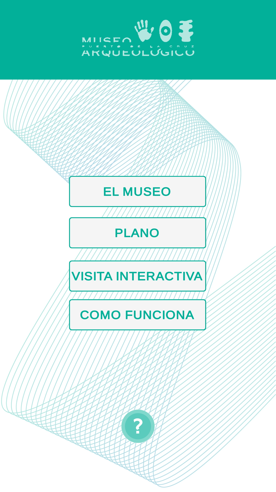
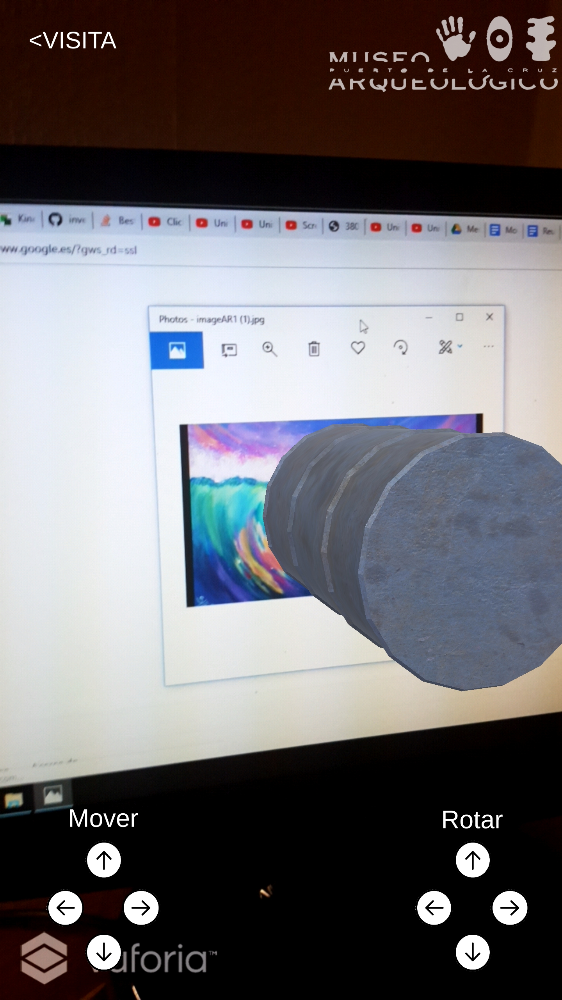

# **Demo AR guio**
### App prototipo para la interacción con cuadros y modelos 3D en un museo mediante Vuforia en Unity.

**Demo (Video)**: https://www.youtube.com/watch?v=IyQU8vncpcU

**App (Android)**: https://github.com/oscarjcg/demo-ar-guio/tree/master/APK

**Fecha**: Enero, 2019

    
    
    

    Cuadros objetivo de la realidad aumentada:
    
    

 

**Descripción**: Prototipo de app que implementa realidad aumentada para permitir mejorar la visita a un museo mediante la interacción de modelos 3D con cuadros.

**Características**:
* Menú que ofrece información sobre el museo
* La información es proporcionada por el backend del museo
* Visita interactiva:
    * Modelo 3D controlable mediante botones de desplazamiento y rotación

**Entorno de desarrollo**:
* **Sistema operativo:** Windows 10 64 bits
* **Unity:** Unity 2017.4.1f1 Personal 64 bits
* **Microsoft Visual Studio Community 2017:** 15.8.7
